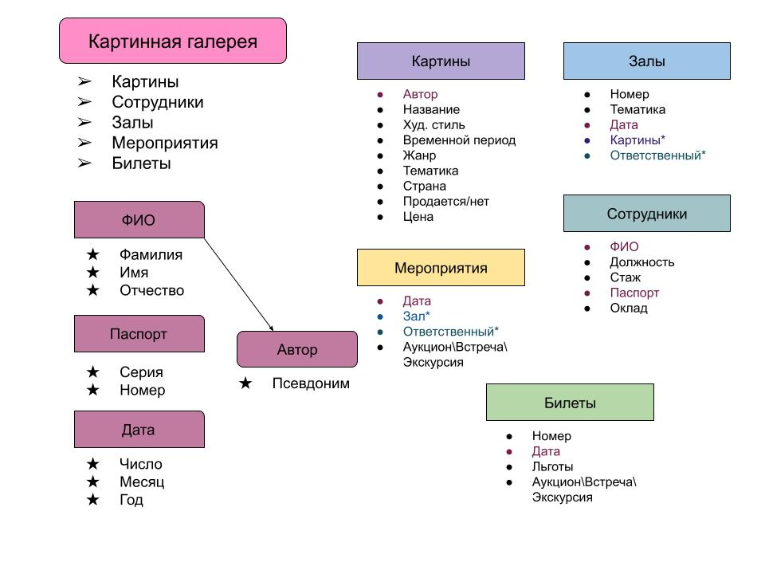

# Individual_project
The project is implemented in C++ in accordance with the OOP paradigm.
**Выбранная предметная область: КАРТИННАЯ ГАЛЕРЕЯ**

**Цель работы:** разработать программное обеспече*ние для мониторинга экспонатов, залов, билетов и мероприятий в картинной галерее.

*Задачи проекта:*

Создать программное обеспечение для мониторинга экспонатов, залов, билетов и мероприятий в картинной галерее.

Обеспечить администратору возможность быстро и легко выполнять свои функции:

— добавлять и удалять экспонаты;
— создавать выставки в залах;
— составлять расписание мероприятий;
— вести учёт проданных билетов.

В приложении должна быть удобно организована вся информация о картинах, позволяющая их классифицировать.

*Функциональные требования:*

Приложение должно быть реализовано в виде программы для Windows с удобным меню, качественным отображением информации и простыми формами для заполнения данных.

*Основные функции приложения:*

-Приложение должно поддерживать авторизацию по логину и паролю.

-Основной режим работы приложения упрощает работу администратора, предоставляя все необходимые функции, но ограничивает доступ к информации о сотрудниках.

-Доступ к особому режиму создания и изменения сотрудников, назначения им окладов и мониторинга их работы должен осуществляться по особому логину и паролю, которые будут выданы директору.

-Все данные должны храниться в формате CSV и обновляться при каждом запуске приложения.

-При запуске приложения на основе текущей даты удаляется неактуальная информация (прошедшие мероприятия и просроченные билеты).

-В приложении должна быть база данных с полной информацией о картинах, которую может изменять только администратор, чтобы избежать фактических ошибок. 

**Схема классов**

